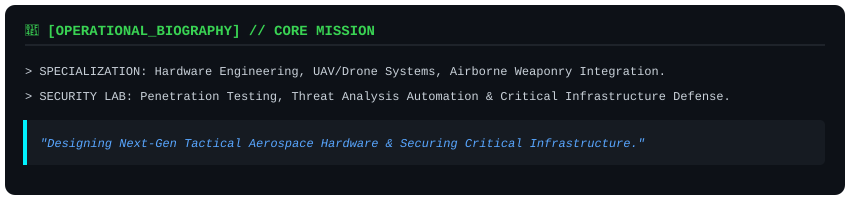
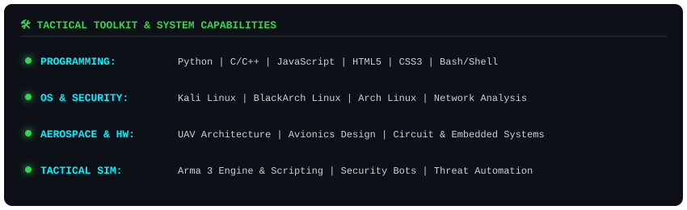
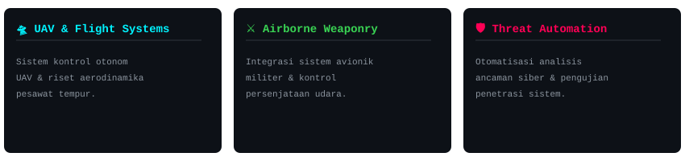

  <!-- 1. Header Banner -->
  

    

  <!-- 2. Operational Biography HUD -->
  

    

  <!-- 3. Tech Matrix -->
  

    

  <!-- 4. Featured Projects Grid -->
  

    

  <!-- 5. System Telemetry & Metrics -->
  
  

    
  

  <!-- Footer -->
  

    <code><b>[TACTICAL HUD: ACTIVE]</b> // "Precision Engineering, Flawless Execution"</code>
  

  

