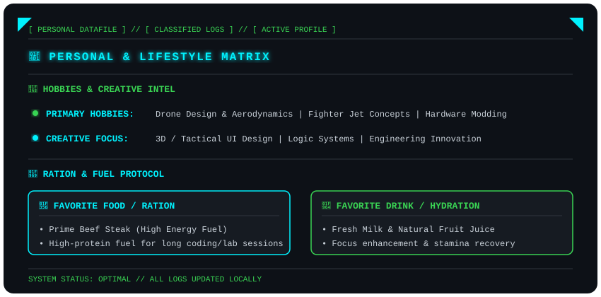

  <!-- Modul 1: Profile HUD Utama (Typewriter Name + Slow Pulse Details) -->
  

  <!-- Modul 2: Personal & Lifestyle HUD (Hobbies, Ration Protocol & Slow Pulse) -->
  

---

  <code>[ SYSTEM STATUS: SECURE ]</code> • <code>[ CLEARANCE: LEVEL 5 ]</code> • <code>[ ARCHITECTURE: OPERATIONAL ]</code>

